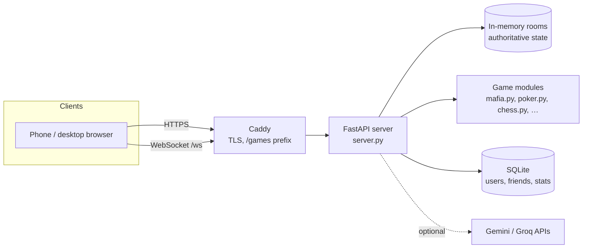

# Lobby.gg

Real-time multiplayer party games in the browser. Create a room, share the 4-letter code, and everyone joins from their own phone. No installs, no accounts required.

**Live:** https://promo-dev.duckdns.org/games/


## What's inside

- **28 games**: social deduction (Mafia, Bunker, Spyfall, Guess Who, Alias), cards (Poker, Durak, UNO), board (Chess, Checkers, Reversi, Quoridor, 3D Connect-4 in a 5×5×5 cube, Battleship, Dots) and solo arcade (Tetris, Snake, 2048, Space Invaders, Wordle).
- **Rooms**: 4-letter codes and invite links, a host who controls the start, lobby chat.
- **Reconnect**: if the network drops mid-game, the client reconnects with backoff and rejoins its seat; a banner shows the connection state.
- **Bots**: fill empty seats, so a 2-player evening still works for a 5-player game.
- **Accounts (optional)**: friends, profiles, stats. Passwords are PBKDF2-hashed, sessions are HMAC-signed cookies.
- **Three languages**: Ukrainian, Russian, English, switchable live without a reload.
- **AI content (optional)**: Gemini generates characters and game variants; Groq Whisper does the voice check in the language trainer.

## Architecture



- **Server-authoritative.** Clients send intents ("play this card"); the server validates them against the game rules and broadcasts each player only the view they're allowed to see. Hidden information (cards in Poker, roles in Mafia) never leaves the server.
- **One WebSocket per player.** Messages are small JSON events; on rejoin the server re-sends the current room state.
- **No frontend framework.** Each game is a single HTML page with vanilla JS, sharing `theme.css`, `shell.js` (navigation, i18n) and `reconnect.js`.

## Stack

`Python 3.11` `FastAPI` `WebSockets` `SQLite` · `vanilla JS` `HTML/CSS` · `Docker` `Caddy`

## Run locally

```bash
docker compose up
```

The server listens on `:8090`. The frontend links assume the app is served under `/games/`, as in production, so put it behind a reverse proxy that strips the prefix. Caddy example:

```
localhost {
    handle_path /games* {
        reverse_proxy localhost:8090
    }
}
```

Then open https://localhost/games/. To create an admin account, set `ROOT_USERNAME` / `ROOT_PASSWORD` before the first start. API keys are optional and only enable the AI features.

## Project layout

```
server.py          HTTP routes, WebSocket hub, rooms, auth, most game logic
*.py               larger games split out (mafia, bunker, poker, chess, quoridor, …)
learn.py           language trainer
static/*.html      one page per game
static/theme.css   design system shared by all pages
static/shell.js    navigation, language switcher
test_quoridor.py   unit tests for the Quoridor engine
```

---

Built by [Pavlo Havras](https://github.com/pavlohavras73).
